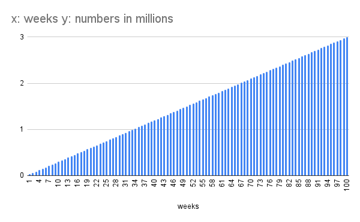

# Allocation

## The LP starts sometime in Q1.&#x20;

Until then the only way to aquire $POTATO is by doing honest work at the [Farm](../howdy-games/locations/farm.md).

## SUPPLY

#### Initial supply

100,000 $POTATO

#### Fully diluted supply

3,000,000 $POTATO

## ALLOCATION

#### **LP rewards**&#x20;

60%

#### **In-game rewards**

10%

#### **Promotion & Marketing**

10%

#### **Team**

10%

#### **Airdrops**

5%

#### **Bounties**&#x20;

5%

